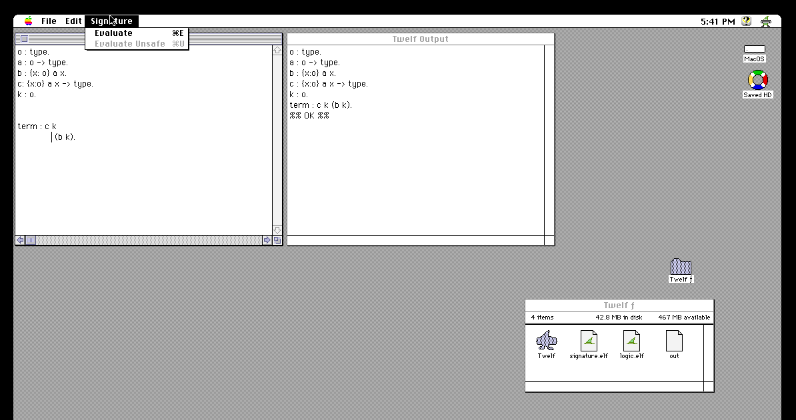

Twelf on Classic Mac
====================



The purpose of this repository is to build a version of the
[Twelf](https://en.wikipedia.org/wiki/Twelf) logical framework that
can be run in the "Classic Mac" environment of approximately [System
7](https://en.wikipedia.org/wiki/System_7) era. The current emulation
target is a Quadra 800 running System 7.5.3.

Status:
 - :white_check_mark: Twelf runs and can typecheck simple signatures that are typed in by hand
 - :white_check_mark: Application and document icons exist
 - :white_check_mark: File IO (Open, Save) is implemented
 - :white_check_mark: Scrolling of the input document works
 - :white_check_mark: Selection of output text works
 - :white_check_mark: Copy/Paste is implemented
 - :no_entry_sign: Revert doesn't work yet
 - :no_entry_sign: Unsafe Eval doesn't work yet

Setup Notes
-----------

Much thanks to [agoode](https://github.com/agoode) for explaining a lot of this.

I'm using [Retro68](https://github.com/autc04/Retro68) to compile C to run on an emulated mac. I build qemu 8.2.2 from source with
```
sudo apt install libglib2.0-dev libpixman-1-dev libgtk-3-dev libasound2-dev libslirp-dev
mkdir build
cd build
../configure --target-list=m68k-softmmu --enable-gtk  --enable-pixman --enable-slirp
make
```

I needed to put in this directory:

- `MacOS7.5.3.img`
  created by `qemu-img create -f raw -o size=2G MacOS7.5.3.img`
- `MacOS7.5.3.iso`
  from https://winworldpc.com/download/3dc3aec3-b125-18c3-9a11-c3a4e284a2ef
- `pram-macos.img`
  created by `qemu-img create -f raw pram-macos.img 256b`
- `Quadra800.rom`
  from https://archive.org/details/mac_rom_archive_-_as_of_8-19-2011 and
  `mv 'F1ACAD13 - Quadra 610,650,maybe 800.ROM' Quadra800.rom`
- `Saved.hda`
  created by going to https://infinitemac.org/1996/System%207.5.3 and moving
  some files (like netscape navigator and stuffit expander) to `Saved HD`
  and then mousing over the grey "Home" next to the apple icon, choosing "Settings"
  and doing "Save Disk Image" as `.hda`

Building and Running the App
----------------------------

### Build

On linux cross-compile host:

```shell
cd docker
make Twelf.bin
```

### Install

On linux cross-compile host:

```shell
make serve # spawns a local web server
```

Start MacOS guest with `./qemu-macos`. Inside MacOS guest:
- Launch Netscape Navigator from `Saved HD`.
- Go to `http://10.0.2.2:8000/` (this is the host-local web server)
- Download `Twelf.bin`
- Expand it in Stuffit Expander to create app named `Twelf`.
